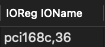

# Guide to Restoring Atheros WiFi Functionality on macOS Monterey+

This guide is an extension of [5T33Z0](https://github.com/5T33Z0/OC-Little-Translated/blob/main/14_OCLP_Wintel/Enable_Features/WiFi_Sonoma.md)'s guide, and based on [PG7](https://www.insanelymac.com/forum/topic/359007-wifi-atheros-monterey-ventura-sonoma-work/)'s tutorial on InsanelyMac. 

## Purpose of This Guide

#### Some steps can be simplified.
* Instead of forcing OCLP to root patch, you can just tweak your config so OCLP will automatically detect **"Legacy Wireless"** _out of the box_.

## Steps

### 1. Download Required Files
Download the OCLP app (not the source code) where you can easily access it later.

Download the following:
* [`corecaptureElCap.kext`](https://github.com/dortania/OpenCore-Legacy-Patcher/tree/main/payloads/Kexts/Wifi)
* [`IO80211ElCap.kext`](https://github.com/dortania/OpenCore-Legacy-Patcher/tree/main/payloads/Kexts/Wifi)
* [`AMFIPass.kext`](https://github.com/dortania/OpenCore-Legacy-Patcher/tree/main/payloads/Kexts/Acidanthera)
* chunnann's [`AirPortAtheros40.kext`](https://www.insanelymac.com/forum/topic/312045-atheros-wireless-driver-os-x-101112-for-unsupported-cards/?do=findComment&comment=2509900) **10.11.x version** (el-capitan)

### 2. Modify Kexts
1. Delete all three kexts inside the Plugins folder of `IO80211ElCap.kext`.
2. Add Chunnann's version of `AirportAtheros40` inside the `IO80211ElCap.kext`'s Plugins folder.
   * You could also keep and try the `AirportAtheros40.kext` that came with the `IO80211ElCap.kext` instead of Chunnan's.
   * If your card was not included in Chunnan's list, try the one that came with `IO80211ElCap.kext`.
4. If using Chunnan's, delete __CodeSignature_ and _Version.plist_ inside `AirportAtheros40`.
5. If using Chunnan's, open _Info.plist_ under AirportAtheros40, find `com.apple.iokit.IO80211Family`, and replace it with `com.apple.iokit.IO80211ElCap`.
### 3. Update config.plist

#### Kernel Section

* Add the kexts and adjust their `MinKernel` accordingly.

* Remove any previously added kexts such as `HS80211Family`, along with its matching `AirportAtheros40`; the kexts we just added will work for earlier macOS versions too.


#### Device Properties Section

Add these in device properties of your WiFi's device path:
| Key*   | Value      |   Type |
|--------|------------|--------|
| IOName |  | String |
| compatible|  | String |
| device-id |  | Data |

* The `IOName`, `device-id`, and `compatible` properties are used to spoof to one of the Atheros cards listed in `Info.plist` inside `AirportAtheros40`.

These are the devices listed inside `AirportAtheros40`'s `Info.plist`. Choose the closest one for your card. 
||`IOName` and `compatible`|`device-id`|Note|
|-|-|-|-|
|AR93xx Wireless Network Adapter| pci168c,30 | 30000000 | Used in iMac12,x |
|AR928X Wireless Network Adapter| pci168c,2a | 2A000000 | Used in iMac11,x |
|| pci106b,0086 | 00860000 ||  
|AR242x / AR542x Wireless Network Adapter | pci168c,1c | 1C000000 ||
|AR5416 Wireless Network Adapter | pci168c,23 | 23000000 ||
|AR5418 Wireless Network Adapter| pci168c,24 | 24000000 ||

Example:
* AR9287 with an IOName `pci168c,2e`, must set its `IOName` and `compatible` to `pci168c,2a`, and its `device-id` to `2A000000`.
* AR9485 with an IOName `pci168c,32`, must set its `IOName` and `compatible` to `pci168c,30`, and its `device-id` to `30000000`.

> If you use the chunnan version of AirportAtheros40, don't add the `device-id` and `compatible`.

This will allow OCLP to automatically detect **"Legacy Wireless"**, eliminating the need to [force-enable Wi-Fi Patching in OCLP](https://github.com/5T33Z0/OC-Little-Translated/blob/main/14_OCLP_Wintel/Enable_Features/WiFi_Sonoma.md#troubleshooting-force-enable-wi-fi-patching-in-oclp).

### Misc/Security Section
* Change `SecureBootModel` to `Disabled`.
   * Note: Do an NVRAM reset at least once everytime you change this value.
> Changing the secure boot status **requires** an NVRAM reset, if not some variables are retained which can cause issue with IMG4 verification in macOS. - [Khronokernel](https://github.com/mrlimerunner/sonoma-wifi-hacks?tab=readme-ov-file#pre-root-patching)
<br>

> [ApECID](https://dortania.github.io/OpenCore-Post-Install/universal/security/applesecureboot.html#apecid) *cannot* be used with root patches, it needs to be disabled and remain disabled.

### NVRAM Section
* Change `csr-active-config` to `03080000`.
* Add `amfi=0x80` to boot-args.
  
Restart and open the OCLP app, then apply root patches.

#### For AR9565 users, import the set of patches `ar9565.plist` from this repo under `Kernel -> Patches` of your config.plist:
* Patches are based on ATH9Fixup source code. Even `Kernel` -> `Patch` is meant to be used for kexts that resides in S/L/E, these set of patches will just works with the injected `AirportAtheros40` kext. `MinKernel` was set to `22.0.0` (Monterey) so it won't apply to `AirportAtheros40` that lives in S/L/E around High Sierra and earlier.


* Unlike AR93xx, AR928x, AR24x, and AR54xx, which may work out of the box with just spoofing, AR946x, AR9485, and AR9565 might require additional tweaking to function correctly. Based on my testing with two different laptops with AR9565, both indeed needed them. If you have AR946x or AR9485, and after following this entire guide, even if the kexts are loaded but the WiFi still isn't working, please create a new issue in the issues tab. (I will be copying the patches from ATH9Fixup into a .plist, just like ar9565.plist)

# Supplemental Guide: Assigning an ACPI Name

This section addresses a specific scenario where the guide may not work as expected. It applies if, after following the steps above, OpenCore Legacy Patcher (OCLP) doesn't show **"Legacy Wireless"** for your Atheros WiFi card.


### Issue Overview
If you have already followed the guide above, but OCLP does not show a "**Legacy Wireless**". Your WiFi card is probably hidden under a PCI bridge, and/or not enumerated in ACPI at all. OpenCore's Device Properties can only overwrite properties for named devices in ACPI.

To solve this, you need to assign a name to the card in ACPI using an SSDT. This allows you to successfully inject the necessary device properties so that OpenCore Legacy Patcher (OCLP) can recognize the WiFi card.

#### Example:
It ends with `pci168c,36`, which is **unnamed**, so the `IOName` we try to inject is **not** applied.


If it has a name, such as `ARPT`. In this case, the `IOName` we try to inject is applied.


### Steps to Assign an ACPI Name

1. Download, and run Hackintool
2. Identify PCI Path
* Navigate to the PCIe tab. Identify your WiFi card and note its ACPI path and debug values. For instance:


**`PCI0`**<sup> @0 /</sup> **`RP04`**<sup> @1C,3 /</sup> pci168c,36<sup> @0</sup>
* Path: PCI0.RP04 (actually the ACPI path for it's parent/PCI Bridge)

Download the sample SSDT, and edit it according to your values:

```asl
DefinitionBlock ("", "SSDT", 2, "ARPT", "WIFIPCI", 0x00001000)
{
    External (_SB_.PCI0.RP04, DeviceObj)  // Replace "PCI0.RP04" with your WiFi's parent/PCI Bridge ACPI path

    Scope (_SB.PCI0.RP04)  // Replace "PCI0.RP04", same as above
    {
        Device (ARPT) // We assign a name for "pci168c,36" as "ARPT", "ARPT" is the ACPI name of WiFi card in Macs.
        {
            Name (_ADR, 0) 
        }
    }
}
```

Save the edited SSDT file and add it to your OpenCore ACPI folder. Ensure your config.plist is updated to include the new SSDT by adding it to the ACPI section of your config.plist.

After restart, in my case, **PCI0**<sup> @0 /</sup> **RP04**<sup> @1C,3 /</sup> `pci168c,36`<sup> @0</sup> would now be **PCI0**<sup> @0 /</sup> **RP04**<sup> @1C,3 /</sup>`ARPT`<sup> @0</sup>

Before:

After:


You can now see the `IOName` is properly injected/spoofed. Force root patching would not be necessary anymore as OCLP will now recognize the spoofed `IOName` (of an iMac11,x Atheros card - of which OCLP supports).

|Before|After|
|-|-|
|||

Open the OCLP app, then apply root patches.

Credits:
* [PG7](https://www.insanelymac.com/forum/topic/359007-wifi-atheros-monterey-ventura-sonoma-work/) for the tutorial
* [Chunnan](https://www.insanelymac.com/forum/topic/312045-atheros-wireless-driver-os-x-101112-for-unsupported-cards/?do=findComment&comment=2509900) patches from ATH9Fixup
* [Dortania](https://github.com/dortania/OpenCore-Legacy-Patcher/tree/main/payloads/Kexts/Wifi) for IO80211ElCap.kext
* [Alejandro](https://github.com/aleelmaitro/Hackintosh-Atheros-Wi-Fi-Legacy-Cards) information in regards of which `device-id` is appropriate for specific Atheros Wireless Card, and MAJOR corrections.
